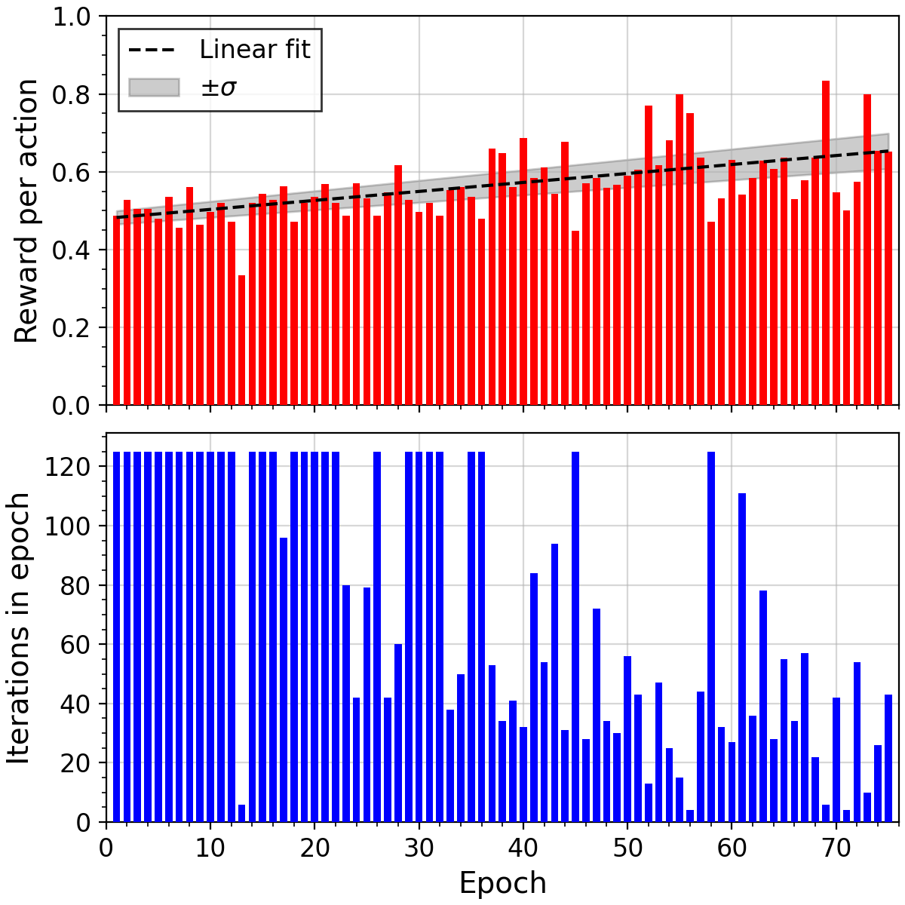
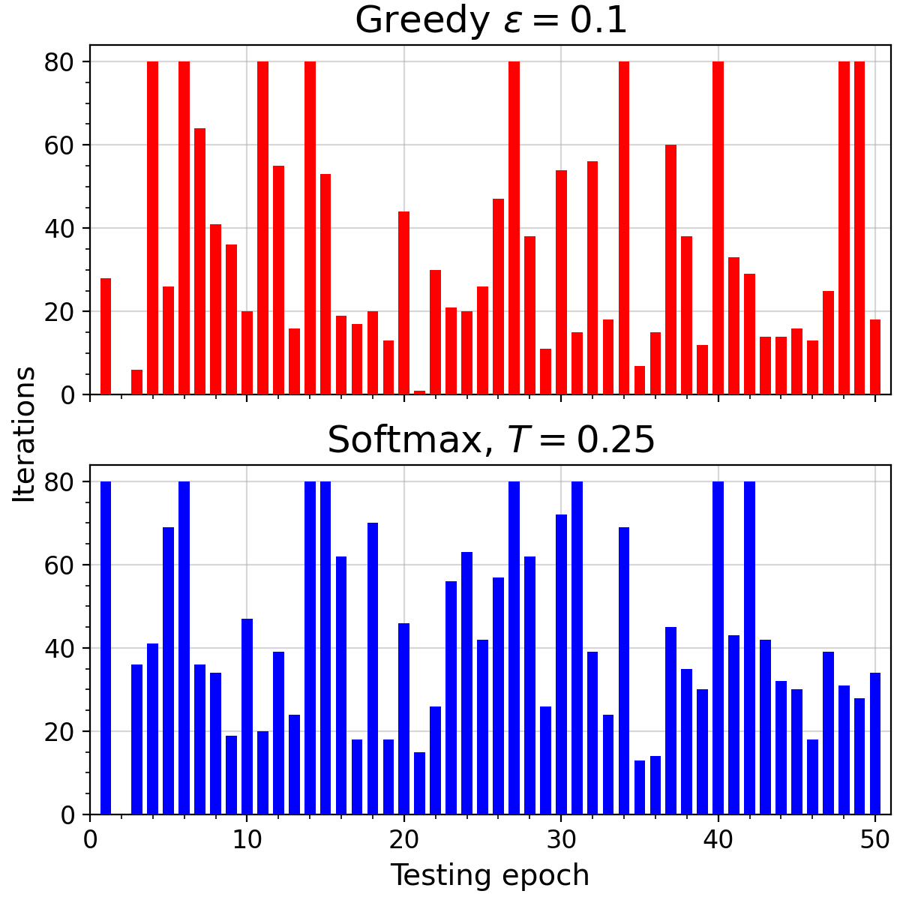
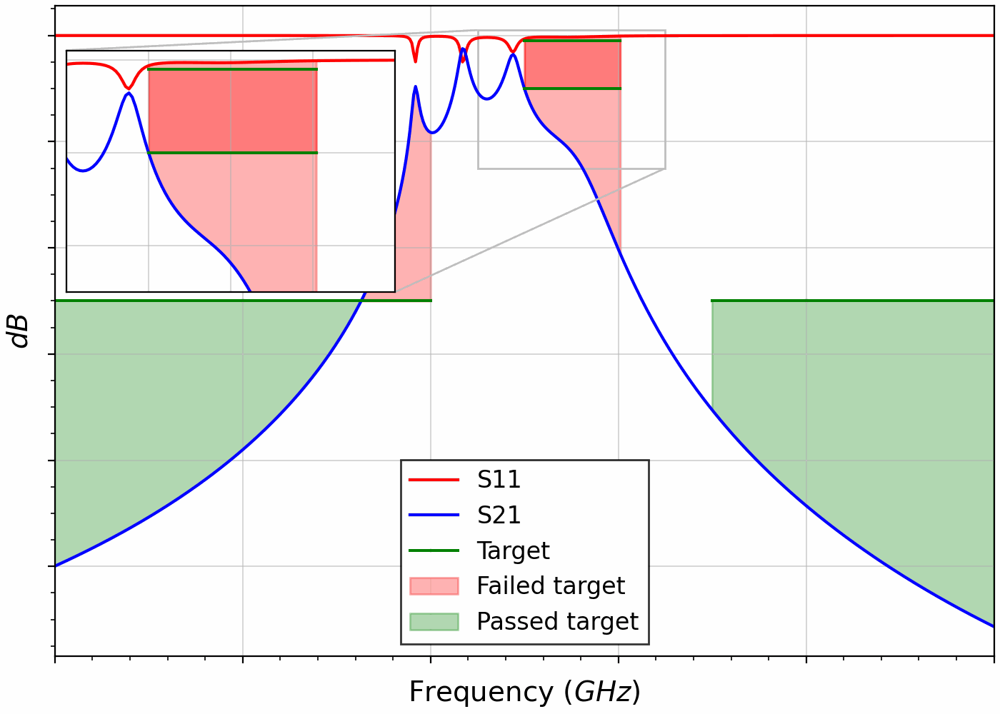

Using deep learning and simulations of a cavity filter in HFSS, I developed an algorithm for automatic cavity filter tuning with a success rate of 85%.

Above, the training process of agent responsible for the final tuning of the filter is shown - maximizing the reward per action and decreasing the number of iterations with each pasing training epoch.

Below, a test of the final tuning is shown comparing two action selection strategies.

Finally, an animation of a complete tuning is shown.

This project was carried out as my Bachelor's project.