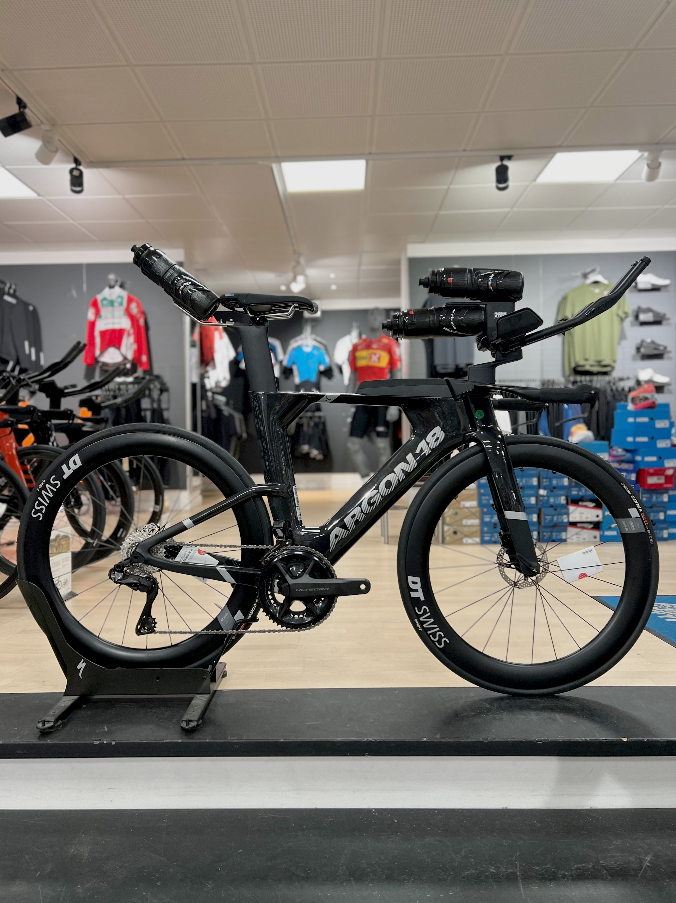
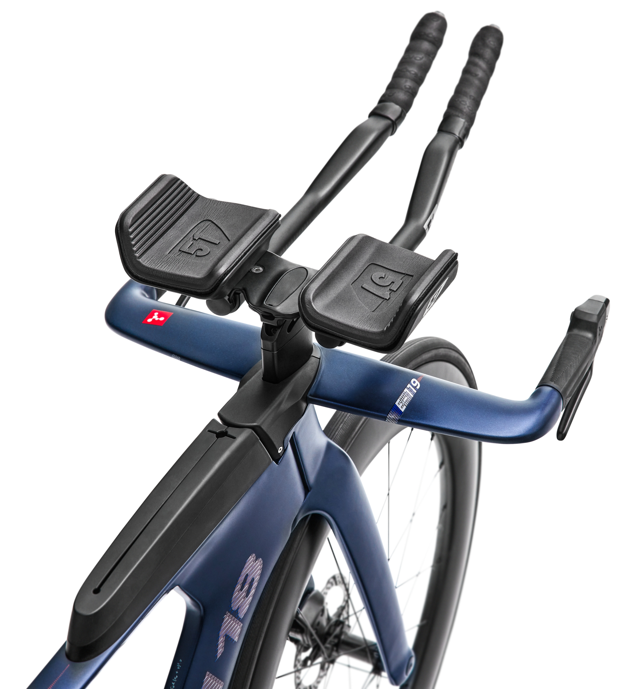
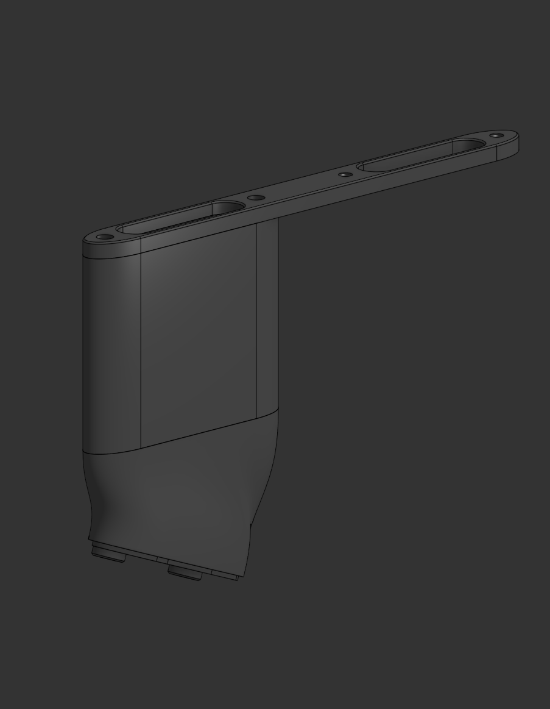
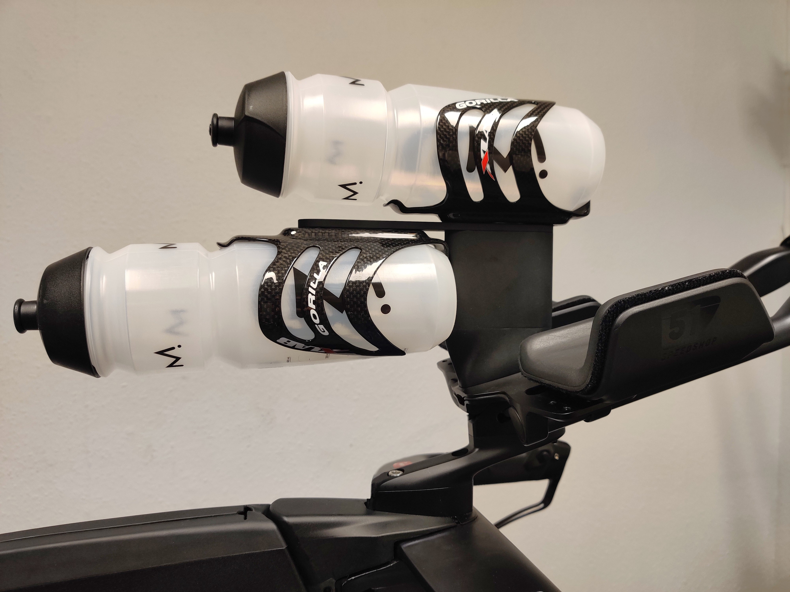
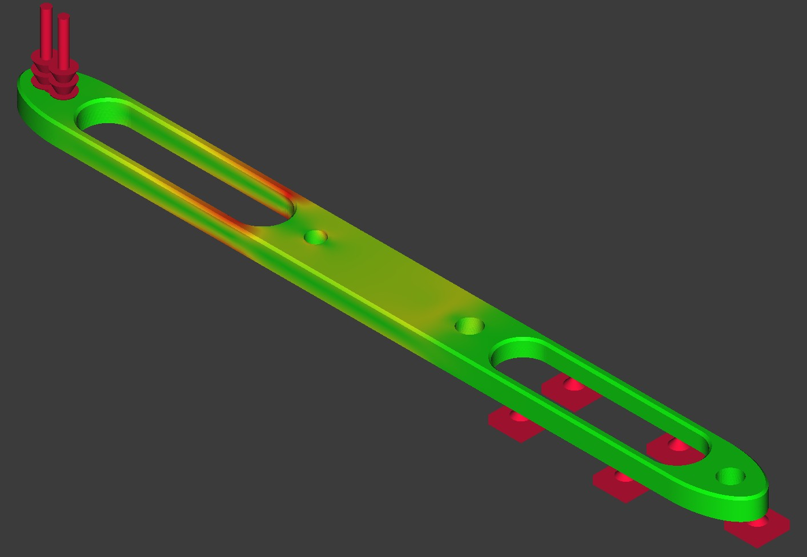

### Preface

In triathlon - especially long distance such as the full and half ironman - aerodynamics plays a crucial role in reducing the amount of required pedal power output while not impacting the velocity of the rider. At the same time it's equally, if not more, important that the athlete fuels with hydration and carbohydrates to ensure performance throughout the entire race. This often leads to requiring multiple bottles with fluids - often exceeding two or even three bottles. How to place these bottles on the bike without impacting the aerodynamics of the rider is an expensive question - often involving multiple hours of wind tunnel testing. Generally, placing bottles between the arms and just below the torso of the athlete has been proven to generally be a *fast* solution.

As I bought my own triathlon bike, I quickly ran into the issue of not having enough space for bottles, which motivated me to find a solution.

### The solution
The bike in question is an Argon 18 E119 - a bike which includes state of the art technology to make the bike as configurable and aerodynamic as possible.

[Image source](https://www.argon18.com/en-dk/bikes/triathlon/e-119-tri-disc/sram-force-etap-axs)

At the center of the cockpit - ie. the armrests for laying in the aerodynamic position - a rubber lid can be removed to reveil an inset in the cockpit baseplate. Luckily, this contains two M5 threaded holes which I took advantage of in my design. In short, I had four requirements to the design.

* Customizable
* Durable
* Light weight
* Easily integratable

I decided to split the design into three parts - a *mount*, *spacer*, and an *arm* which all serve their own purpose. Not only does this make the design highly modular, it also allows for limiting the angle- and height adjustment to a seperate part, namely the mount and spacer respectively.

The final design is designed in CAD and shown above. The mount (bottom piece) slots into the cockpit inset and fastened using the M5 threaded holes. The mount itself is angled to the desired angle and contains two M5 threaded holes seperated by a distance corresponding to that of a standard bottle cage. The spacer is stacked on top of the mount and is hollowed to reduce weight. Similarly, the arm is stacked in top of the spacer and a long M5 bolt is used to fastend a bottle cage to the top of the system and to fastend the arm and spacer to the mount. A second pair of threaded through-holes in the arm allows for mounting a second bottle.

The final design, mounted on a bike, is shown above. All parts are sand blasted and anodized for finishing and the entire kit weighs no more than approximately 200 grams depending on the configuration. This excludes bottles and bottle cages of course.

### FEM Analysis
As weight is a major concern, making the parts as light as possible was important. However, it should not be achieved at the cost of durability. Therefor, FEM analysis was performed on all parts of the system to ensure a significant margin to their yield point.

For example, the BTA Arm shown above carries the entire load from the second bottle. Therefor, I tested the part using a single static load of 100N in the most distant thread. This would approximately correspond to 10 times the static load of a single 975mL bottle and allows for a large margin of safety even when riding over bumps on a rough road surface. It was found that the maximum von Mises stress of the part was within 50% of the yield strength of Aluminum 6061. Therefor, for the BT Arm only, I selected Aluminum 7075 instead of the 6061 alloy for increased durability.

### DFM
To cut the cost of all parts, I carefully spent time going over the features and their dimensions of all parts to reduce machining costs. The most significant things I took into considerations before sending the parts for manufacturing are listed below.

* Hole diameters
* Fillets
* Chamfers
* Number of part setups
* Depth of cavities

Especially the limits to the machinable cavity depth was a major part in the choice of diving the kit into three seperate part. If I wanted to hollow to part to save weight, the cavity would be very difficult to machine for taller variations - while also resulting in an increase of setups. Similarly, I made sure hole diameters were similar, where possible, and of standard sizes which would be easy to machine.

