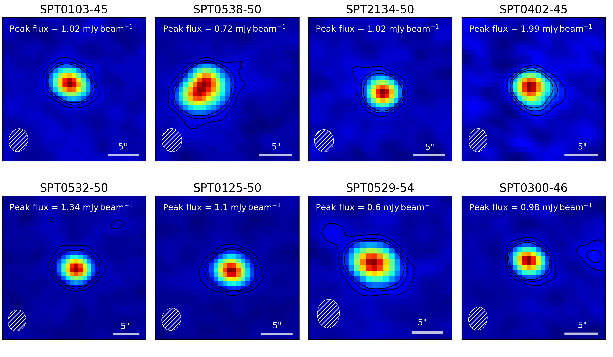
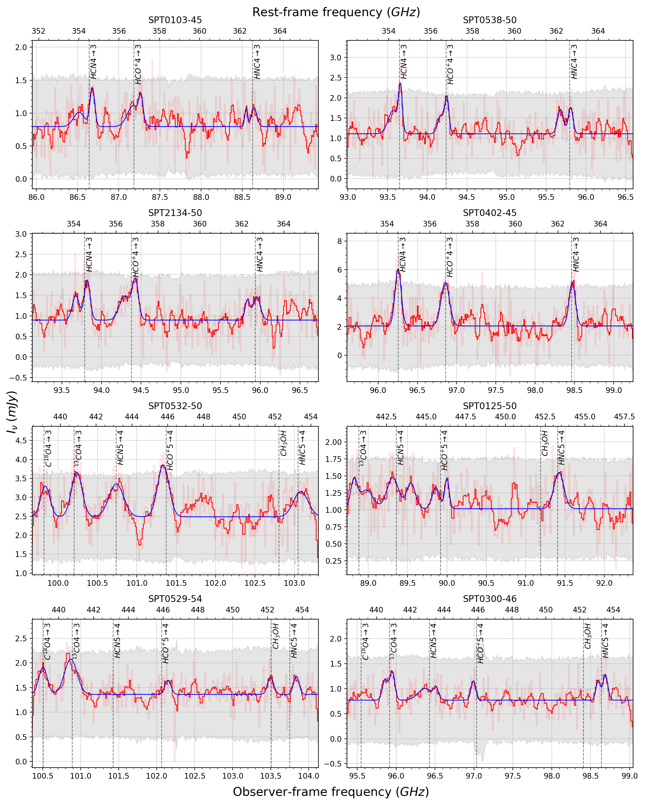

As a part of my "fagprojekt" on my second year of studying, I was fortunate enough to get the opportunity to process raw observation data from the ALMA observatory.
This consisted of eight distant, and gravitationally lensed, starburst galaxies observed around a rest frame frequency of approximately 350-450GHz, corresponding to the $5\rightarrow4$ and $4\rightarrow3$ transitions of dense gas tracers.

From the observations I extracted spectra from the integrated flux of each channel inside the $3\sigma$ contour of each galaxy.
The results can be seen below together with fitted line profile models.

