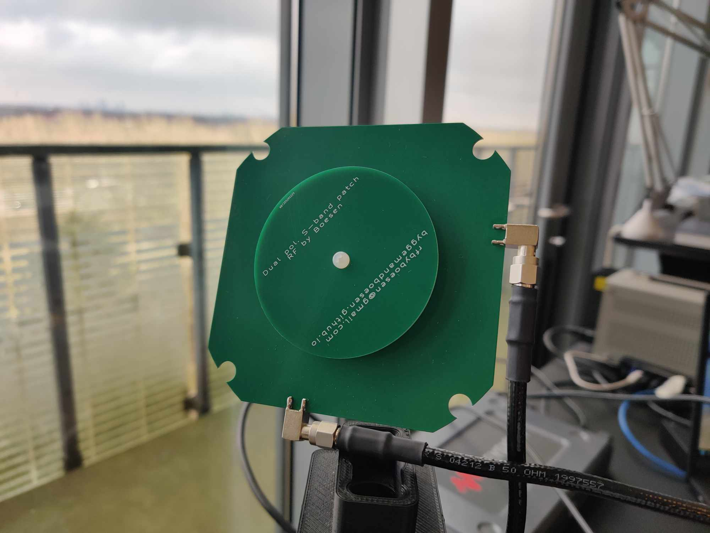

With the goal of providing ultimate flexibility for the reception of low-Earth orbiting satellites, I present an L- and S-band patch antenna with both LHCP and RHCP readily available.

Both antennas are operated from a single port at a time based on the desired polarization and achieve a realized gain of approximately 7dB and an axial ratio of 1dB in the operational bandwidth.

Above, the scattering parameters of both versions are compared to their simulated equivalents. In this case, port 1 is the RHCP port and port 2 the LHCP port. Below, the measured radiation pattern of the L-band antenna is shown at its design center frequency of 1700MHz.

Since both left- and right handed polarization can easily be switched between, the antennas can easily be used with an without a parabolic reflector and on any circular polarized satellite.

Above, the reception of the S-band transmitter of the CORIOLIS satellite is shown - easily receiving a decodable signal as shown in the lower left constellation diagram.

Please, get in touch if this antenna is of any interest for you.