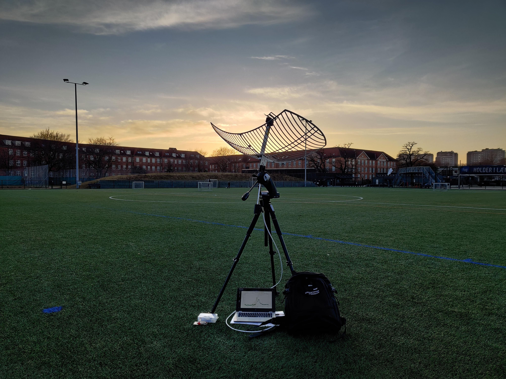
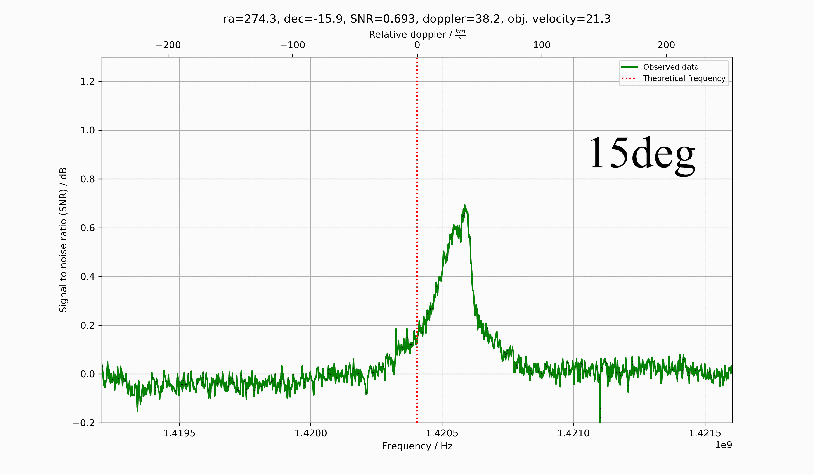
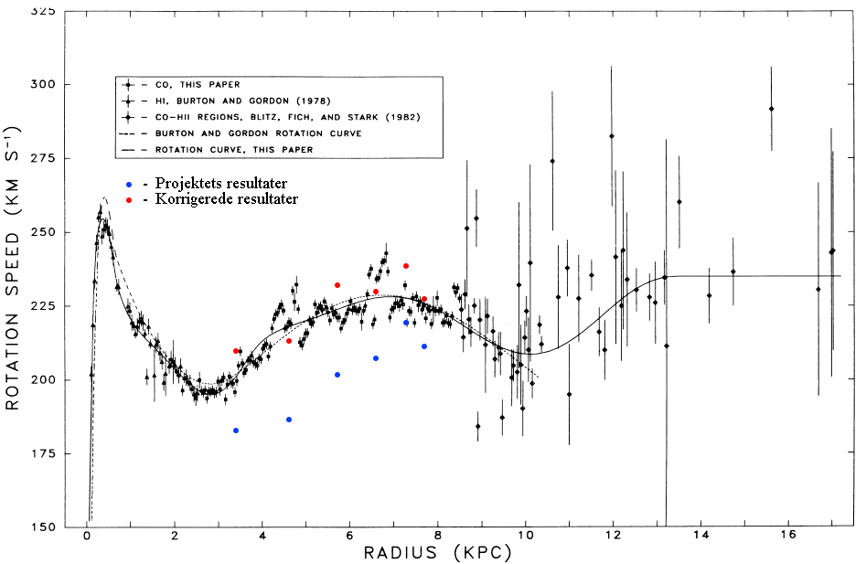

In my second last year of high school I was introduced to the world of software defined radios and I was instantly hooked.
Haven been interested in astronomy several years in advance, I was intrigued on how I could combine the two hobbies.

Thus, in my final year of high school, I began writing python software to interface with an [RTL-SDR](https://www.rtl-sdr.com/about-rtl-sdr/) and process the received samples such that the hydrogen line could be received.

I used a wifi grid antenna from Ebay and a [Nooelec H1 SAWbird LNA](https://www.nooelec.com/store/sdr/sdr-addons/sawbird/sawbird-h1.html) in combination with the RTL-SDR and my software. Performing a sweep across the galactic plane - observing at a 10 degree interval - yielded the animation below.

I used these observations to estimate the rotational curve of our galaxy.

Where the red dots represent the rotational velocities corrected for the orbital motion of the Earth around the sun, whereas the blue dots have not been corrected.

With this project, I participated in Unge Forskere which is a national science competition for danish high school students and [won first place across all categories](https://ungeforskere.dk/tidligere-vindere/vindere-2021-2/vindere-senior-2021/). The software written during the project [can be found on GitHub](https://github.com/byggemandboesen/H-line-software).

