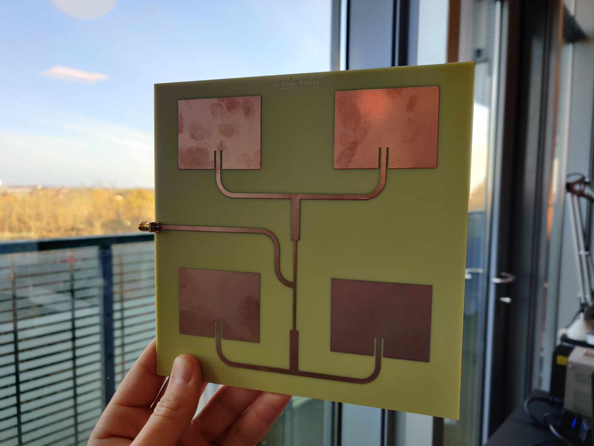

After [my first antenna design project](../quasi_yagi_antenna/quasi_yagi_antenna.md) I was motivated to expand my skills by learning new tools.
Thus, I chose to design a simple patch array for L-band weather satellite reception using CST and Keysight ADS.

I started by designing a single patch antenna in CST (and actually also HFSS, but they provided similar results), and optimized the dimensions and feed inset for my desired frequency of operation.

Next, I designed a feed network in ADS where I incorporated quater wave transformer sections for optimal return loss at the input of the network.

The patches and feed network were then combined in a complete model in CST, where I checked that the antenna was still tuned properly.

I manufactured the antenna [using PCBWay](https://www.pcbway.com/project/shareproject/1_69GHz_1_7GHz_2x2_patch_array_antenna_c3108157.html), and once I received it, I compared the simulated and measured radiation pattern and return loss. Both results can be seen below.

Finally, I tested the antenna using a [Nooelec GOES+ SAWbird LNA](https://www.nooelec.com/store/sdr/sdr-addons/sawbird/sawbird-goes.html) and my [Airspy mini](https://airspy.com/airspy-mini/) SDR.

Below, the reception of HRPT from NOAA-18 can be seen. The carrier is strong, but the sidebands is right on the limit of being decodable.

I look forward to using Keysight ADS in more RF projects in the future!
