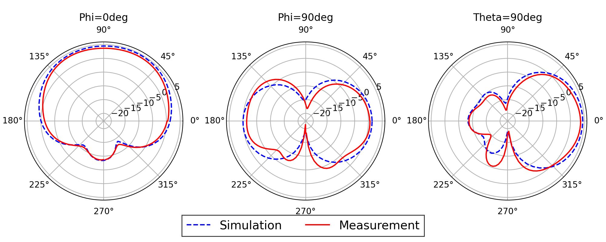
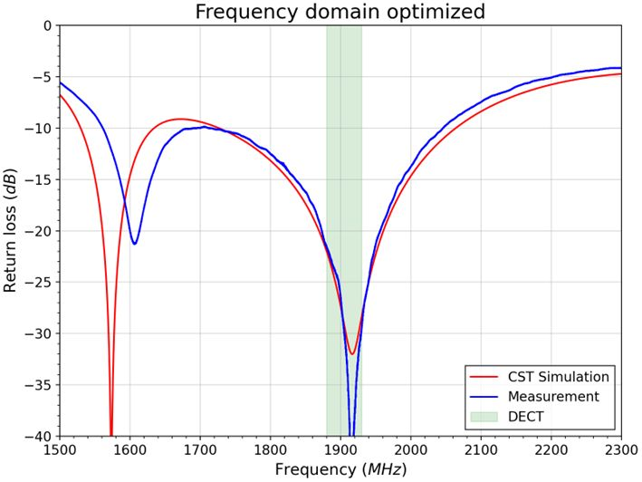

As one of my first projects designing RF components using electromagnetic simulation, I designed a quasi yagi antenna for DECT communication using CST.

I divided the design into two components - the antenna and the balun/impedance matching. The antenna was parametrically modelled in the 3D modeller, and the balun was designed in the schematic editor of CST and imported as a component.

Once combined in a complete 3D model, I optimized the quater wave impedance transforming section to achieve a desired return loss.

I had the opportunity to measure the radiation pattern of the antenna in an anechoic chamber, from which the following results were obtained.

Finally, a comparison between the simulated and measured return loss can also be found below.

This project provided me with very valuable experience in the field of antenna design and -simulation.