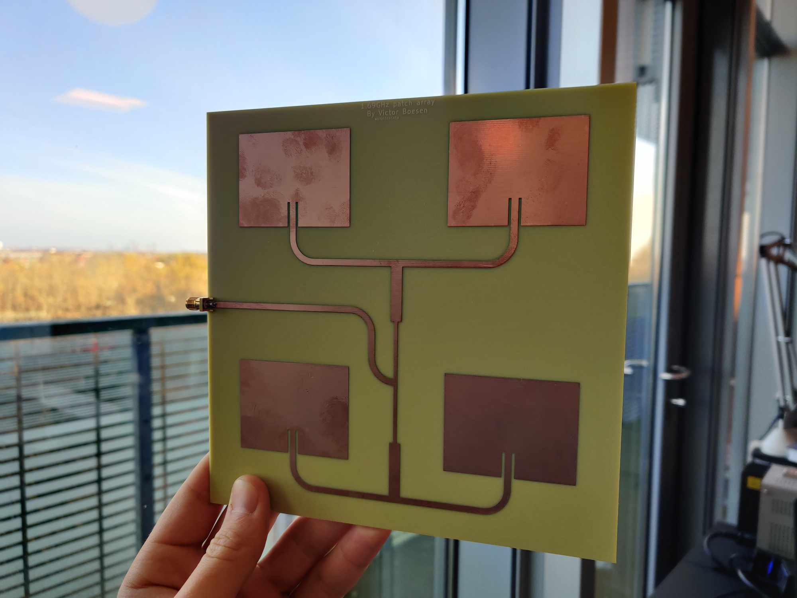

Following my major interest in antennas and RF, I founded my business, RF by Boesen, in the end of 2024.
I specialize in the design of passive RF components - mostly antenna design - using a variety of simulation software to achieve the desired performance.

Reach out to me for inquiries or browse my available products below.

|                                          **Antenna**                                           |**Operational bandwidth**| **Polarization** |   **Gain**   |
|:----------------------------------------------------------------------------------------------:|:-----------------------:|:----------------:|:------------:|
| [Dual pol. L-band patch antenna](../projects/dual_pol_patch_antenna/dual_pol_patch_antenna.md) |   approx. 1.55-1.85GHz  |    RHCP & LHCP   | approx. 7dBi |
| [Dual pol. S-band patch antenna](../projects/dual_pol_patch_antenna/dual_pol_patch_antenna.md) |   approx. 2.1-2.35GHz   |    RHCP & LHCP   | approx. 7dBi |
